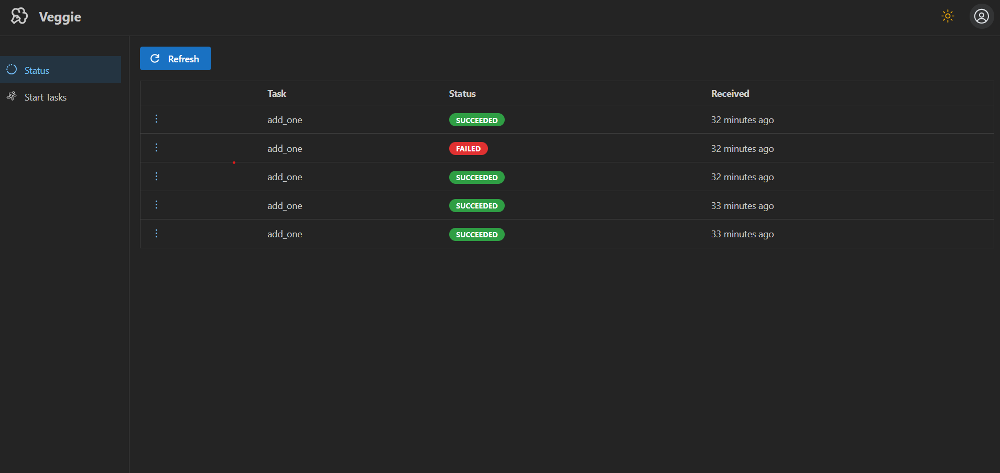
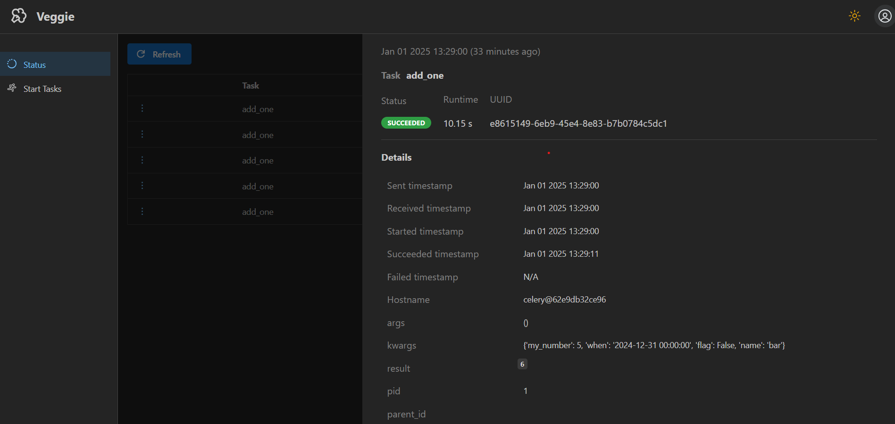
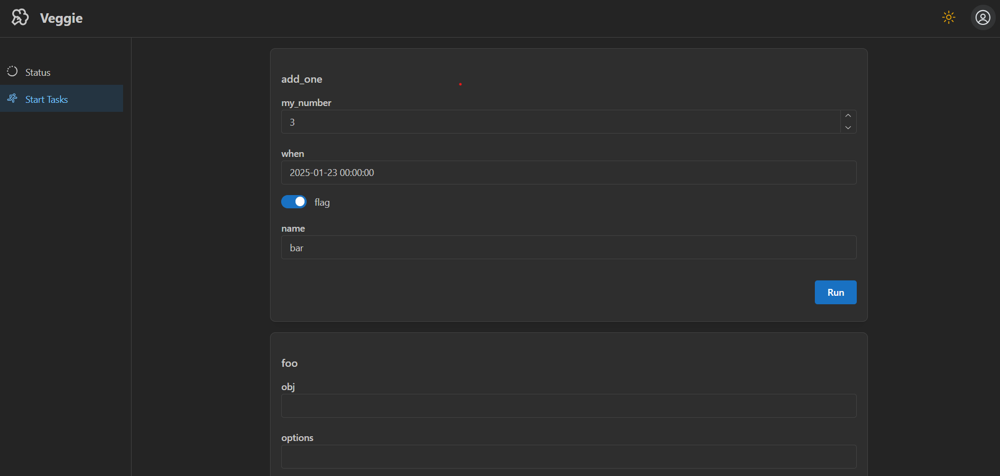

<p align="center">
    
    <div align="center" style="font-size: 1.5em">Veggie - Celery monitoring and execution</div>
</p>
<p align="center">
    
    
    <a href="https://pypi.org/project/veggie/"></a>
    
    
</p>

Veggie is a web-based tool for monitoring the status of Celery tasks and starting tasks through a UI. It stores Celery events in a SQLite database but allows easy switch to another user-defined storage backend.

## Installation
```bash
pip install veggie
```

## Quickstart
To enable better task monitoring, add the following to your Celery application:
```python
celery_app = Celery("myapp")

celery_app.conf.worker_send_task_events = True  # Enables task events
celery_app.conf.task_send_sent_event = True  # Enables sent events
celery_app.conf.task_track_started = True  # Update task result state to STARTED
celery_app.conf.result_extended = True  # Store args and kwargs in the result
```

Start monitoring by adding the following to your Celery application or in a separate script:
```python
from veggie.monitor import CeleryMonitor
from veggie.storage import SQLiteStorage

os.environ["VEGGIE_PORT"] = "5000"  # Set port for the UI and API

if __name__ == "__main__":
    celery_monitor = CeleryMonitor(celery_app=celery_app, storage=SQLiteStorage(path="events.db")) # or any other storage class that inherits from veggie.storage.Storage
    celery_monitor.start()
```

Open your browser at `http://localhost:5000`:

Check the status of past and running tasks:
<p align="center">
    
</p>

Select a task to view its details:
<p align="center">
    
</p>


Start a new task by entering values for its parameters through the UI:
<p align="center">
    
</p>

## REST API
Access the API at `http://localhost:5000/api/`

## Configure your own storage backend
All storage implementations should inherit from the `veggie.storage.Storage` class and implement the `store_event()`, `get_events()` and `get_event_by_id()` methods. For an example, check the [SQLiteStorage](veggie/storage.py) implementation.
